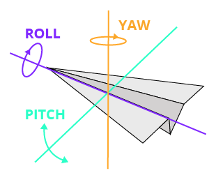
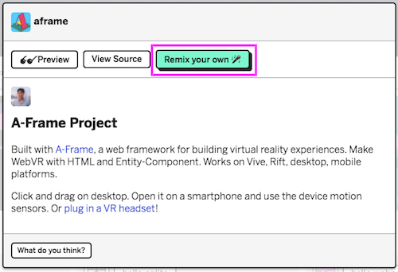
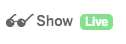
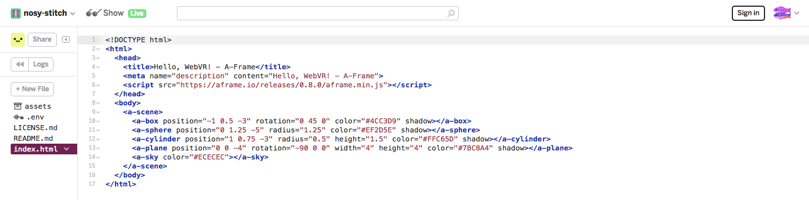
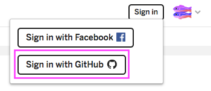
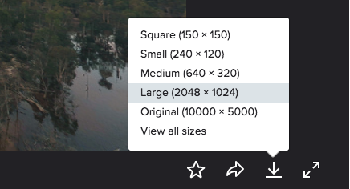
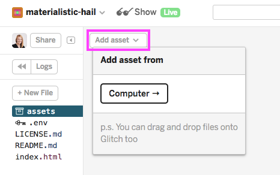
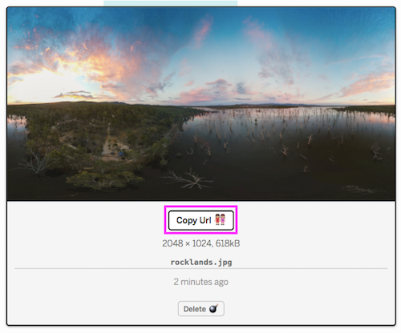
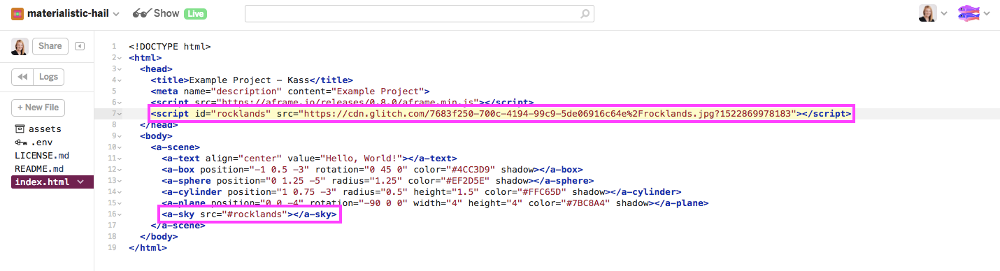

## What is VR?

**Virtual Reality** is a computer-generated 3D environment that simulates a real experience. Level of interactivity can vary from passively observing to device-assisted interactions.

Examples:
* <a href="https://www.youtube.com/watch?v=hEK-J3ZgCZA">Tilt Brush</a>
* <a href="https://experiments.withgoogle.com/webvr/konterball">Konterball (ping pong in VR)</a>
* <a href="https://aframe.io/a-blast/">Mozilla AR A-Blast</a>

**Augmented Reality** is a computer-generated experience where a virtual world is superimposed on the user's view of the real world.

Examples:
* <a href="https://www.pokemongo.com/en-ca/">Pokémon Go</a>
* <a href="https://www.youtube.com/watch?v=QN95nNDtxjo">Super Mario Bros AR prototype</a>.  
* <a href="https://experiments.withgoogle.com/ar/justaline">Just a Line (AR drawing app)</a>

### VR Examples

*Link to examples here*

### Why VR?

What's the value in creating these virtual experiences?

Why virtual over real-life experiences?

### VR versus WebVR

**WebVR** is a JavaScript API that makes it possible to experience VR in our browser. We can use WebVR to develop, experience, and share VR projects.

*Another example of an API (Application Programming Interface) is the <a href="https://developers.google.com/maps/">Google Maps API</a>, which allows developers to add customized maps to websites and apps.*

## Intro to A-Frame

**A-Frame** is an open source framework for developing WebVR. A-Frame is based on HTML, using the `<a-scene>` element. Because it is cross-platform, we can experience A-Frame projects using anything from an Oculus Rift, to the browser on our desktop computer.

Just like other websites, A-Frame projects can be inspected using a built-in visual 3D inspector. We can access this by opening any A-Frame scene, then hitting `<ctrl> + <alt> + i`

### What Can We Create?

Go to [https://aframe.io/](https://aframe.io/) to explore example projects.

>Navigate within a scene by using WASD and arrow keys. Click and drag to turn.

## Today's project

We'll be reimagining Long Lake 58 in 150 years and building a virtual experience to share our vision with others.

*Embed example here*

## Getting Started

### Primitives

A-Frame uses HTML elements called **primitives**. These can be customized using HTML attributes (e.g. `color="red"`).

* **Position** defines an object's position in 3D space (X,Y,Z)
  * X = left-right
  * Y = up-down
  * Z = forward-back
* **Rotation** defines an object's orientation in 3D space (X,Y,Z) - measured in degrees
  * X = pitch
  * Y = yaw
  * Z = roll

### Remixing Projects

We'll be using Glitch to edit and save our A-Frame projects.

**Open the Example Project**

1. Go to [https://glitch.com/~aframe](https://glitch.com/~aframe)
1. Select "Remix Your Own"   
1. Click "Show Live" to preview the project   

**Edit the Code**

1. Go back to the project tab
1. Open index.html. *Anything look familiar?*   
1. Sign in with GitHub to begin editing.   

>## CHALLENGE:
> * Change the colour of the sphere
> * Change the rotation of the box
> * Change the position of the cylinder
> * Add a line of text in the center of your scene (see <a href="https://aframe.io/docs/0.8.0/primitives/a-text.html"> A-Frame primitives</a>)

### Adding Background Images

We can add a background image by applying a 360 image texture to the sky primitive.

For more image options, check out these <a href="https://www.flickr.com/groups/equirectangular/">360° images from Flickr</a>. Save an image by clicking on the image, then the Download icon (bottom, right).   

*Note: We can also capture 360 images using apps like <a href="https://play.google.com/store/apps/details?id=com.google.vr.cyclops&hl=en">Cardboard Camera</a>*

1. Upload image to the "assets" folder   
1. Copy image URL   
1. Add a ``
1. Add a `src` attribute to the `<a-sky>` primitive
  * Updated `<a-sky>` primitive:  
`<a-sky src="#rocklands"></a-sky>`

### Adding Textures

We can add textures to objects, too!

For more image options, check out these <a href="https://www.flickr.com/groups/freetextures/">free textures from Flickr</a>. Save an image using the same steps as above.

1. Upload image to the "assets" folder (same as above)
1. Copy image URL (same as above)
1. Add a ``
1. Add a `src` attribute to the object primitive
  * Updated object primitive - *Replaced `color` with `src`*:  
`<a-plane position="0 0 -4" rotation="-90 0 0" width="4" height="4" src="#ice" shadow></a-plane>`

>## Think, Pair, Share
> Q: Fast forward 150 years! What does Long Lake 58 look like in 2067?  
> Q: What do you wish for this community, what do you hope to see?

### Finding Assets

https://aframe.io/docs/0.5.0/introduction/faq.html#where-can-i-find-assets

### Experience your Virtual World!

Google Cardboard

### Next Steps

**Get Inspired!** Check out <a href="https://twitter.com/aframevr">A-Frame's Twitter page</a> to see what other developers are building.

>### Take-Home Exercise

>Any Minecraft fans? Check out: [aframe-aincraft](aframe-aincraft)

~ End ~

### Heading

>Pink box

**bold**

*Italics*

Code:
    <tag>Content that shows on page.</tag>
      |                               |
      |--opening tag                  |--closing tag

or `code`

[image](http://html5doctor.com/lets-talk-about-semantics/)
