## What is VR?

**Virtual Reality (VR)** is a computer-generated 3D environment that simulates a real experience. The level of interactivity can vary from passively observing to device-assisted interactions.

Examples:
* <a href="https://www.youtube.com/watch?v=hEK-J3ZgCZA">Tilt Brush</a>
* <a href="https://experiments.withgoogle.com/webvr/konterball">Konterball (ping pong in VR)</a>
* <a href="https://aframe.io/a-blast/">Mozilla AR A-Blast</a>

**Augmented Reality (AR)** is a computer-generated experience where a virtual world is superimposed on the user's view of the real world.

Examples:
* <a href="https://www.pokemongo.com/en-ca/">Pokémon Go</a>
* <a href="https://www.youtube.com/watch?v=QN95nNDtxjo">Super Mario Bros AR prototype</a>.  
* <a href="https://experiments.withgoogle.com/ar/justaline">Just a Line (AR drawing app)</a>


## Why VR?

*Why create virtual experiences?*

*What's the value of using virtual experiences over real-life experiences?*

VR provides immersive storytelling and gaming opportunities, and is a new medium for creativity and self-expression. VR is also being used to positively impact society! Here are a few examples:

* **VR Therapy**: Using VR to face fears like <a href="https://newatlas.com/fearless-spider-fear-oculus-rift-vr/45146/">arachnophobia</a> or <a href="https://newatlas.com/public-speaking-simulation-gear-vr/44871/">public speaking</a>.
* **VR + Healthcare**: As a tool for surgical training, or to help patients <a href="https://med.stanford.edu/news/all-news/2017/09/virtual-reality-alleviates-pain-anxiety-for-pediatric-patients.html">manage pain</a>.
* **VR + Education**: Providing students access to new places and experiences via <a href="https://edu.google.com/expeditions/#about">Google Expeditions</a>


### Some Considerations

* Motion sickness
* Unstability or 'newness'
* Accessibility and cost


## VR versus WebVR

**WebVR** is a JavaScript API that makes it possible to experience VR in our browser. We can use WebVR to develop, experience, and share VR projects.

*Another example of an API (Application Programming Interface) is the <a href="https://developers.google.com/maps/">Google Maps API</a>, which allows developers to add customized maps to websites and apps.*


## Intro to A-Frame

**A-Frame** is an open source framework for developing WebVR, based in HTML. Because it is cross-platform, we can experience A-Frame projects using anything from an Oculus Rift, to the browser on our desktop computer.

Just like other websites, A-Frame projects can be inspected using a built-in visual 3D inspector. We can access this by opening any A-Frame scene, then hitting `<ctrl> + <alt> + i`


### What Can We Create?

Go to [https://aframe.io/](https://aframe.io/) to explore example projects (left column).

>Navigate within a scene by using WASD or arrow keys. Click and drag to turn.


## Today's Project

We'll be reimagining Long Lake 58 in 150 years and building a virtual experience to share our vision with others.


>## Fast forward 150 years! What does Long Lake 58 look like?
>## What do you wish for this community, what do you hope to see?


## Getting Started

### Primitives

A-Frame uses HTML elements called **primitives**. These can be customized using HTML attributes (e.g. `color="red"`).


* **Position** defines the position in 3D space (X,Y,Z) - measured in meters
  * X = left-right
  * Y = up-down
  * Z = forward-back
* **Rotation** defines the orientation in 3D space (X,Y,Z) - measured in degrees
  * X = pitch
  * Y = yaw
  * Z = roll


## Remixing Projects

We'll be using Glitch to edit and save our A-Frame projects.

### Open the Example Project

1. Go to [https://glitch.com/~aframe](https://glitch.com/~aframe)
1. Select "Remix Your Own" <br> 
1. Click "Show Live" to preview the project <br> 


### Edit the Code

1. Go back to the project tab
1. Open index.html. *Anything look familiar?* <br> 
1. Sign in with GitHub to begin editing. <br> 


>## Challenge:
> * Change the colour of the sphere
> * Change the rotation of the box
> * Change the position of the cylinder
> * Increase the size of the plane (hint: which html attributes affect size?)
> * Add a line of text in the center of your scene (see <a href="https://aframe.io/docs/0.8.0/primitives/a-text.html"> A-Frame primitives</a>)


## Using Assets

### Uploading Assets

1. Upload images to the "assets" folder
<br>

**Finding Background Images**

When uploading background images, make sure that they have a 2:1 aspect ratio. Search for '360 images' or see this <a href="https://www.flickr.com/groups/equirectangular/">360° image library on Flickr</a>. Save an image by clicking on the image, then the Download icon (bottom, right).


*Note: We can also capture 360 images using apps like <a href="https://play.google.com/store/apps/details?id=com.google.vr.cyclops&hl=en">Cardboard Camera</a>*

**Finding Textures**

We can add textures to objects, too! Check out this <a href="https://www.flickr.com/groups/freetextures/">free texture library on Flickr</a> for more options. Save an image using the same steps as above.


### Asset Management System

This system helps your browser cache images, in order for the scene to load more quickly. We can use the asset management system by adding a new primitive called `<a-assets>`.

1. Add an `<a-assets>` opening and closing tag just inside of your `<a-scene>`

```html
<a-scene>
  <a-assets>

  </a-assets>
  <!-- ... -->
</a-scene>
```


## Adding a Background Image

1. Locate your image in the assets folder and copy the image URL <br> 
1. Create an `` tag that links to this url
1. Name the image by adding an `id`
1. Reference the asset by adding a `src` attribute to the `<a-sky>` entity

```html
<a-scene>
  <a-assets>
    
  </a-assets>

  <a-sky src="#rocklands"></a-sky>

  <!-- ... -->
</a-scene>
```


## Adding Textures

1. Copy the image URL (same as above)
1. Create an `` tag that links to this url
1. Name the image by adding an `id`  
1. Reference the asset by adding a `src` attribute to the entity

```html
<a-scene>
  <a-assets>
    
    
  </a-assets>

  <a-plane src="#ice" position="0 0 -4" rotation="-90 0 0" width="4" height="4" shadow></a-plane>

  <!-- ... -->
</a-scene>
```


## Adding Animation

We can use the `<a-animation>` primitive to animate entities within our scene. Nest it within the entity you want to animate (e.g. between the `<a-box>` opening and `</a-box>` closing tag)

```html
<a-box position="-1 0.5 -3" rotation="0 45 0" color="#4CC3D9" shadow>
  <a-animation attribute="position" to="-1 1.5 -3" direction="alternate" dur="2000"
      repeat="indefinite"></a-animation>
</a-box>
```

* **Attribute** specifies which part we are animating (e.g. position, rotation, scale.. even material.color!)
* **To** is the value we are animating it to (e.g. 1 meter higher than the original position)
* **Direction** is the direction of the animation (between `from` and `to`)
* **Dur** is how long it takes (in milliseconds)
* **Repeat** is the amount of times this happens

See the <a href="https://aframe.io/docs/0.8.0/core/animations.html">Animations documentation</a> for more options!


## Adding Interactivity

Most users don't have access to VR equipment and will view our projects directly in their browser. We'll be experiencing our final projects using Google Cardboard. That being said, we'll want to consider this when programming interactions into our scenes. **Cursor components** are accessible for both of these viewing options, so any events involving gazing or clicking should work.

A-Frame automatically sets up a default camera in our scene. We can't currently see our mouse cursor, so we need to add an `<a-cursor>` primitive inside of `<a-camera>`.

```html
<a-scene>
  <!-- ... -->

  <a-camera>
    <a-cursor></a-cursor>
  </a-camera>
</a-scene>
```

*Note: If your `<a-plane>` disappears, try giving it a position attribute.*

### Animating on Events

We can use events to trigger animations using the <a href="https://aframe.io/docs/0.8.0/core/animations.html#begin"> `begin` attribute</a>.

For example, when the user clicks on the box, it begins moving:

```html
<a-scene>
  <!-- ... -->

  <a-box position="-1 0.5 -3" rotation="0 45 0" color="#4CC3D9" shadow>
    <a-animation begin="click" attribute="position" to="-1 1.5 -3" direction="alternate" dur="2000" repeat="indefinite"></a-animation>
  </a-box>

  <a-camera>
    <a-cursor></a-cursor>
  </a-camera>
</a-scene>
```

Or, when the user looks at the sphere it changes colours, then changes back when they look away:

```html
<a-scene>
  <!-- ... -->

  <a-sphere position="0 1.25 -5" radius="1.25" color="#EF2D5E" shadow>
    <a-animation begin="mouseenter" attribute="material.color" from="#EF2D5E" to="red" dur="3000"></a-animation>
    <a-animation begin="mouseleave" attribute="material.color" from="red" to="#EF2D5E" dur="3000"></a-animation>
  </a-sphere>

  <a-camera>
    <a-cursor></a-cursor>
  </a-camera>
</a-scene>
```

For more event options, see the <a href="https://aframe.io/docs/0.8.0/components/cursor.html#events">Cursor documentation</a>.


## Adding Audio

Audio can enhance our scene by creating a more immersive experience for the user. To find audio that is safe for reuse, try [https://freesound.org/](https://freesound.org/) or [https://www.jamendo.com/start](https://www.jamendo.com/start). *Bonus! Upload your own audio created in <a href="https://www.soundtrap.com">Soundtrap</a>!*

1. Upload your chosen audio file into the assets folder
1. Copy the audio URL <br> 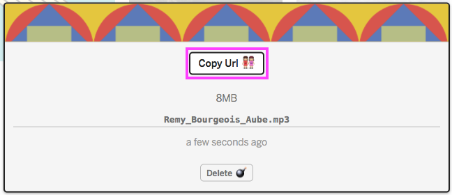
1. Add an audio element inside of the `<a-assets>` primitive, linking to the audio URL
1. Add a `preload` attribute to your audio file

We can either add `autoplay` to play the audio automatically **OR** name the audio file using an `id` and add it later on.

```html
<a-scene>
  <a-assets>
    <!-- ... -->
    <audio src="https://cdn.glitch.com/linktoaudio1" autoplay preload></audio>
    <audio id="pop" src="https://cdn.glitch.com/linktoaudio2" preload></audio>
  </a-assets>

  <!-- ... -->
  <a-cylinder sound="src: #pop; on: click;" position="1 0.75 -3" radius="0.5" height="1.5" color="#FFC65D" shadow></a-cylinder>

<a-scene>
```

*Does the format of the `sound` attribute look familiar? The properties (e.g. `on`) and values (e.g. `click`) are formatted like CSS!*

For more audio options, check out the <a href="https://aframe.io/docs/0.8.0/components/sound.html">Sound documentation</a>.


## Main Project

>## Exercise:
> Create a virtual representation of your vision of Long Lake 58 in 150 years. You can use **these assets** to help build your scene, or upload your own assets from the resources listed above.


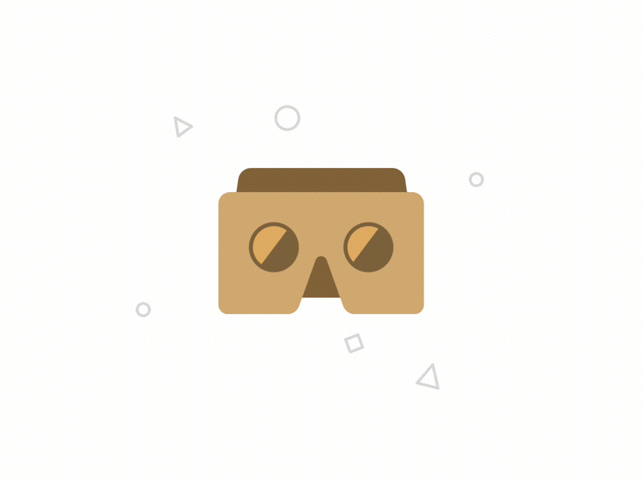
<!-- Cardboard gif from https://dribbble.com/shots/4153349-Cardboard -->


### Finished? Experience your Virtual World!

Follow these steps to view your A-Frame scene using <a href="https://vr.google.com/cardboard/">Google Cardboard</a>:

1. Rename your project <br> 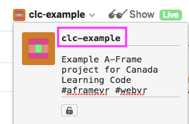
1. Open up a browser and go to your project's URL (same as 'Show Live') <br> 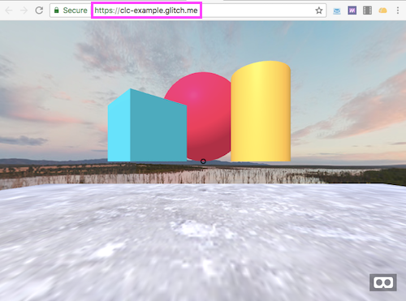
1. Click on the Google Cardboard icon <br> 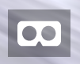
1. Place your mobile device in the viewer and enjoy!

**NOTE: Audio will not play on mobile phones running iOS. Use Androids with Google Cardboard if you'd like to experience sound.**


## Bonus: A-Frame Registry

### Need an Extra Challenge?

We can add additional animations and special effects via the <a href="https://aframe.io/aframe-registry/">A-Frame Registry</a>. This is a library of ready-to-use components created by other developers in the A-Frame community.

In this example, we will add a gravity effect using the Physics System.

1. Go to the <a href="https://aframe.io/aframe-registry/">registry</a> and search for the **Physics System** component (click on the component name) <br> 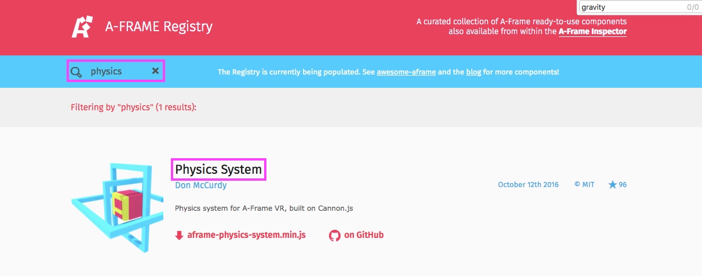
1. On the component page, scroll down to find the installation script - copy this <br> 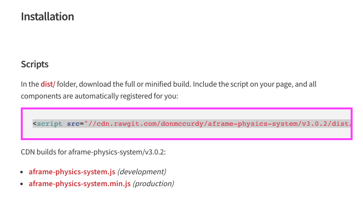
1. Go back into your project, and paste the script in the `<head>`
1. 'Show Live' and inspect your scene (`<ctrl> + <alt> + i`) - zoom by scrolling with your mouse/trackpad
1. Let's apply a gravity effect. Click on an entity (e.g. sphere), then **add component: dynamic-body** <br> 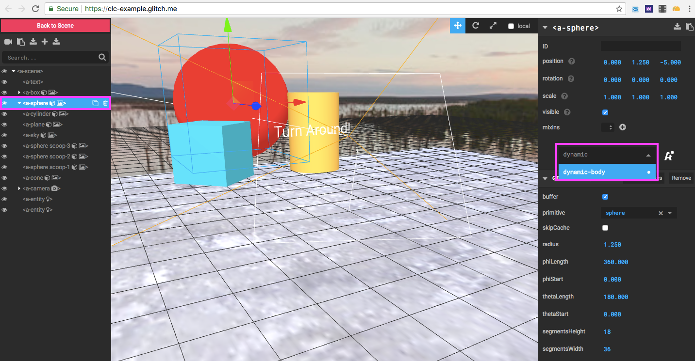
1. We also need to prevent this entity from falling out of our scene. Click on the plane, then **add component: static-body** <br> 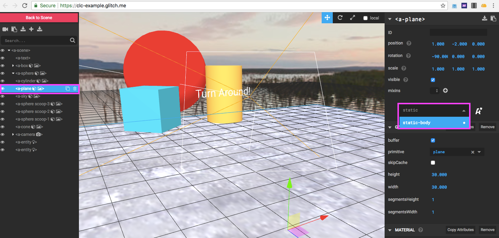
1. Preview changes by selecting **Back to Scene** <br> 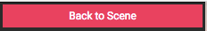
1. If you're happy with how it looks, copy the code that you added: find the new component then select **Copy Attributes** <br> 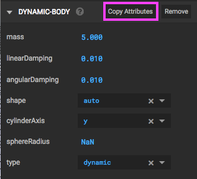
1. Go back into your code, and paste this inside of the entity <br> (e.g. `<a-sphere dynamic-body="sphereRadius: NaN" ...>`)

*When adding additional components, read the instructions to have a better understanding of how it works. Visit <a href="https://www.npmjs.com/package/aframe-physics-system">this page</a> for more info on the Physics System component.*


>## TIP:
> When inspecting our scene, it can be difficult to tell similar entities apart. Name entities using `id` to keep your code organized. (e.g. `<a-sphere id="scoop1">`)


## Next Steps

**Get Inspired!** Check out <a href="https://twitter.com/aframevr">A-Frame's Twitter page</a> to see what other developers are building.


>## Take-Home Exercise
> Any Minecraft fans? Check out: <a href="https://glitch.com/~aframe-aincraft">aframe-aincraft</a> <br>
> You can recreate this project by following <a href="https://aframe.io/docs/0.5.0/guides/building-a-minecraft-demo.html">this tutorial</a>.


~ End ~
